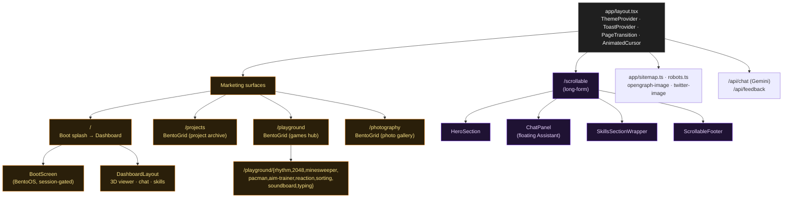
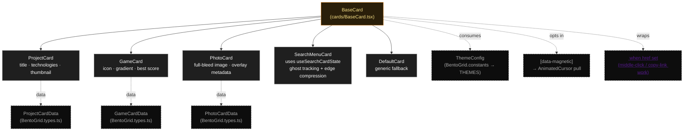

# bentOS Architecture

A visual map of the portfolio. Three diagrams:

1. [Route tree](#1-route-tree) — public surfaces split by interaction style.
2. [Subsystem map](#2-subsystem-map) — how the BentoGrid, 3D viewer, chat, and theme system fit together.
3. [BentoGrid card hierarchy](#3-bentogrid-card-hierarchy) — `BaseCard` and its renderers.

For conventions and pitfalls, see [`../CLAUDE.md`](../CLAUDE.md).

---

## 1. Route tree

Two distinct interaction surfaces share the same shell (`app/layout.tsx`: theme + toast + page transition + animated cursor).

- **Marketing surfaces** — boot splash, dashboard, infinite BentoGrid for projects/playground, gallery.
- **Long-form surface** — `/scrollable`, a top-to-bottom narrative variant of the same content.



---

## 2. Subsystem map

The four major runtime subsystems and the lib modules they pull from.

- **BentoGrid** drives `/projects` and `/playground`. Layout planning, card pool, camera, and Matter.js physics are split into focused folders.
- **3D viewer (Dimension)** is composed: `Dimension.tsx` wires the controller hook to the viewport (Canvas + lighting), the scene primitives, and the UI overlays.
- **Chat panel** is a portable component used in two places: terminal-style on the dashboard, floating on `/scrollable`. The route handler lives at `/api/chat`.
- **Theme system** is a CSS-variable layer; `lib/colors.ts` is the typed surface and `theme-context.tsx` is the runtime toggle.

```mermaid
graph LR
  subgraph BentoGridSub["BentoGrid (components/BentoGrid)"]
    BG[BentoGrid.tsx]
    Views[views/<br/>DesktopCanvasView<br/>MobileScrollView]
    Cards[cards/<br/>BaseCard · ProjectCard · GameCard<br/>PhotoCard · SearchMenuCard]
    Core[core/<br/>useCamera · useViewport<br/>useBoardController (rAF spawn/despawn)<br/>useSearchCardState (ghost tracking)]
    Layout[layout/<br/>gridOccupancy (radial findNearest)<br/>positions (originOffset centering)<br/>cardSizes (mixed/detail/2x2)]
    Physics[physics/<br/>engine · forces<br/>usePhysicsWorld]

    BG --> Views
    Views --> Cards
    Views --> Core
    Core --> Layout
    Core --> Physics
  end

  subgraph DimensionSub["3D viewer (components/Dimension)"]
    Dim[Dimension.tsx]
    Vp[Dimension.viewport.tsx<br/>R3F Canvas + lights]
    Ctrl[useDimensionController]
    Scene[scene/<br/>ModelWrapper · LODModel · GLTFModel · ProceduralCat<br/>SceneErrorBoundary · FallbackModel<br/>ResponsiveOrbitControls · StationaryBackground]
    DimUI[ui/<br/>widgets · feedback · modals · shared]

    Dim --> Vp
    Dim --> Ctrl
    Vp --> Scene
    Dim --> DimUI
  end

  subgraph ChatSub["Chat (components/Chat)"]
    Chat[Chat.tsx]
    ChatHooks[Chat.hooks.ts<br/>addAssistantMessage · clear]
    ChatStore[chat-storage.ts<br/>sessionStorage]
    ChatParts[parts/<br/>messages · input]

    Chat --> ChatHooks --> ChatStore
    Chat --> ChatParts
  end

  subgraph ThemeSub["Theme (lib + styles)"]
    ThemeCtx[lib/theme-context.tsx]
    ThemeCss[app/styles/theme.css<br/>--primary (orange) · --ai (purple)]
    Colors[lib/colors.ts<br/>CSS_VARS · COLORS · BUTTON_CLASSES]

    ThemeCtx --> ThemeCss
    Colors --> ThemeCss
  end

  Layoutcomp[app/layout.tsx]
  Cursor[components/cursor/AnimatedCursor]
  Boot[components/BentoOS/BootScreen]
  Dashboard[components/Dashboard/DashboardLayout]
  Viewfinder[components/Viewfinder]
  ApiChat[app/api/chat/route.ts<br/>Gemini]

  Layoutcomp --> ThemeCtx
  Layoutcomp --> Cursor
  Cursor -.magnetic targets.-> Cards

  Boot -.session gate.-> Dashboard
  Dashboard --> Viewfinder
  Dashboard --> Chat
  Viewfinder --> Dim

  Chat --> ApiChat

  Cards --> Colors
  DimUI --> Colors

  classDef sub fill:#1f1f1f,stroke:#666,color:#fafafa
  classDef leaf fill:#111,stroke:#444,color:#ddd
  class BentoGridSub,DimensionSub,ChatSub,ThemeSub sub
```

---

## 3. BentoGrid card hierarchy

`BaseCard` is the shared shell — motion + theming + optional anchor wrapper + magnetic hover opt-in. Every card surface composes it.



**Key contracts**

- `BaseCard` renders an `<a href>` when `href` is provided; otherwise a `<div>`. Don't replace the anchor with a `button + router.push` — middle-click, copy-link, and right-click all rely on it.
- Magnetic hover is opt-in via `BaseCard`'s `magnetic` prop, which sets `[data-magnetic]` on the actual hover target (anchor when present, wrapper otherwise). The cursor is the only consumer.
- Card data is a discriminated union: `CardData = ProjectCardData | GameCardData | PhotoCardData`. The `BentoGrid` chooses the renderer from `card.type`.
- `SearchMenuCard` has three layout modes driven by `compression`/`edge`: free (full card), compact bar (top/bottom edge), icon strip (left/right edge).
- **Card sizing** is controlled by `cardSizeMode` (`'mixed'` | `'detail'` | `'2x2'`). Photo cards are always 1x1. In `'detail'` mode, featured projects get 2x2, others 2x1.
- **Grid centering**: `calculateInitialPositions` returns an `originOffset` that maps between pixel coordinates (shifted so search card center = origin) and grid cell coordinates. The tick loop in `useBoardController` applies this offset when converting viewport center → grid cell.
- **Radial placement**: `GridOccupancy.findNearest` searches outward in concentric rings, picking the candidate closest to center by Euclidean distance for balanced, symmetric layouts.
- The `?seed=1` / `?debug=queue` query params swap real card data for synthetic 80-card seeds (`debugSeed.ts`); the debug HUD in `DesktopCanvasView` is gated by `useDebugFlag()` (visible in development OR with `?debug=1`).
