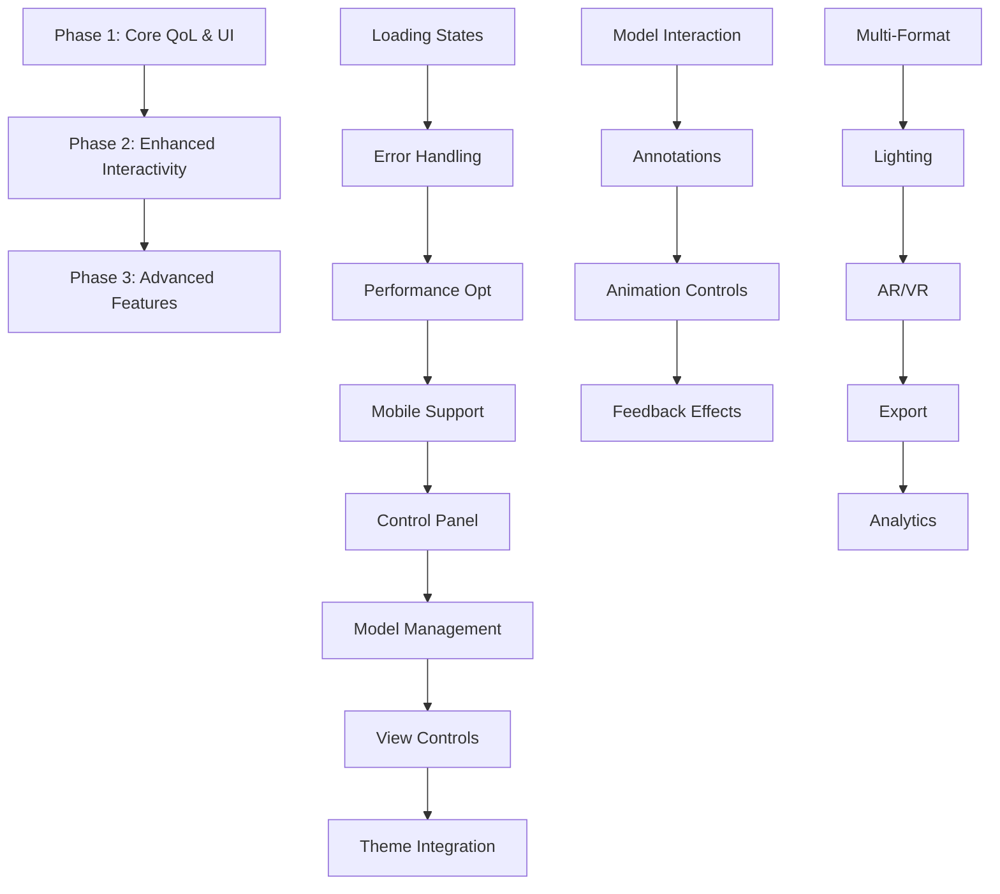

# 3D Model Viewer Enhancement Plan

## Overview
This plan outlines the phased enhancement of the `Dimension.tsx` component for the portfolio website's 3D model viewer. The current implementation is a basic STL loader with orbit controls, auto-rotation, and grid background. Enhancements focus on QoL improvements, UI controls, interactivity, and advanced features while maintaining performance and portfolio suitability.

## Current State Analysis
- **Component**: React Three Fiber-based viewer
- **Features**: STL loading, auto-rotation, click scaling, orbit controls, grid environment
- **Integration**: Split-screen layout (50% viewer, 50% chat/menu)
- **Pain Points**: No loading states, limited controls, single model, basic interactivity

### Current Strengths
- Clean, minimal setup with dynamic imports for SSR compatibility
- Basic interactivity (click scaling, orbit controls)
- Professional grid environment
- Responsive layout integration

## Enhancement Phases

### Phase 1: Core QoL & UI (High Priority - Foundation)
Focus on essential improvements for professional portfolio presentation.

#### QoL Improvements (High Priority - Easy Wins)
1. **Loading States & Progress Indicators**
   - Add Suspense fallback with loading spinner during model load
   - Progress bar for large STL files
   - Skeleton loader for initial render

2. **Error Handling & Fallbacks**
   - Graceful error UI if model fails to load (e.g., "Model not found" message)
   - Retry button for failed loads
   - Fallback to placeholder geometry if STL is invalid

3. **Performance Optimizations**
   - Level-of-detail (LOD) system for distant views
   - Geometry simplification for mobile devices
   - Texture compression and lazy loading
   - Frustum culling optimizations

4. **Responsiveness & Mobile Support**
   - Touch-friendly orbit controls (adjust damping/sensitivity)
   - Auto-disable auto-rotation on mobile to prevent battery drain
   - Responsive UI panel positioning (overlay vs. sidebar)
   - Keyboard shortcuts for desktop users

#### UI Enhancements & Buttons (High Priority - User Experience)
5. **Control Panel Overlay**
   - Floating toolbar with icons: play/pause rotation, reset camera, zoom fit
   - Material controls: color picker, roughness slider, metalness toggle
   - Wireframe/solid view toggle
   - Lighting preset selector (studio, outdoor, dramatic)

6. **Model Management**
   - Dropdown/file picker for switching between multiple models
   - Thumbnail gallery for model selection
   - Model info display (file size, dimensions, vertex count)

7. **View Controls**
   - Preset camera positions (front, side, top, isometric)
   - Fullscreen toggle button
   - Screenshot capture with download
   - 360° view export (sequence of images)

8. **Theme Integration**
   - Match portfolio's dark/light theme
   - Customizable grid colors via props
   - Environment lighting that adapts to theme

### Phase 2: Enhanced Interactivity (Medium Priority - Engagement)
Build on Phase 1 with better user interaction and feedback.

#### Better Interactivity (Medium Priority - Engagement)
9. **Enhanced Model Interaction**
   - Hover highlighting with tooltips (show part names if available)
   - Click-to-select parts with info panels
   - Drag-to-rotate override (manual control)
   - Pinch-to-zoom on mobile

10. **Annotations & Hotspots**
    - Clickable pins on model with descriptions
    - Measurement tools (rulers, angles, dimensions)
    - Exploded view toggle for assemblies
    - Section planes for internal views

11. **Animation Controls**
    - Speed slider for auto-rotation
    - Pause on hover/interaction
    - Keyframe animations if model supports (GLTF)
    - Morph target sliders for deformable models

12. **Feedback & Effects**
    - Particle effects on interactions
    - Sound cues (optional, muted by default)
    - Haptic feedback on mobile

### Phase 3: Advanced Features (Lower Priority - Future-Proofing)
Advanced capabilities for long-term portfolio evolution.

#### Advanced Features (Lower Priority - Future-Proofing)
13. **Multi-Format Support**
    - GLTF/GLB loader (animations, materials, textures)
    - OBJ, PLY, 3MF support
    - Texture mapping and normal maps
    - PBR materials with environment maps

14. **Advanced Lighting & Rendering**
    - HDRI environment maps for realistic lighting
    - Dynamic shadows (soft/hard)
    - Post-processing effects (bloom, depth of field, tone mapping)
    - Volumetric lighting

15. **AR/VR Integration**
    - WebXR support for AR viewing on mobile
    - VR headset compatibility
    - QR code for AR launch

16. **Export & Sharing**
    - Video recording of rotations
    - STL/GLTF export with modifications
    - Shareable links with camera state
    - Embed code generation

17. **Analytics & Tracking**
    - Interaction metrics (views, clicks, time spent)
    - Heatmaps for popular model areas
    - A/B testing for UI variations

## Integration with Portfolio Context
- **Chat Integration**: Allow chatbot to suggest/select models or explain features
- **Project Showcase**: Link models to portfolio projects with metadata
- **Progressive Enhancement**: Core viewer works without JS, enhanced with Three.js
- **Accessibility**: Screen reader support, high contrast modes, keyboard navigation

## Implementation Workflow

## Success Metrics
- Improved load times and error resilience
- Increased user engagement (time spent, interactions)
- Mobile compatibility across devices
- Maintainable, extensible codebase

## Potential Challenges & Considerations
- **Performance**: Large models may need WebGL optimizations or Web Workers
- **Browser Compatibility**: WebXR requires modern browsers
- **File Management**: Secure model hosting and lazy loading
- **User Experience**: Balance feature richness with simplicity for portfolio viewing

## Next Steps
1. Review and approve Phase 1 implementation plan
2. Begin with loading states and error handling
3. Iterate based on user feedback and testing